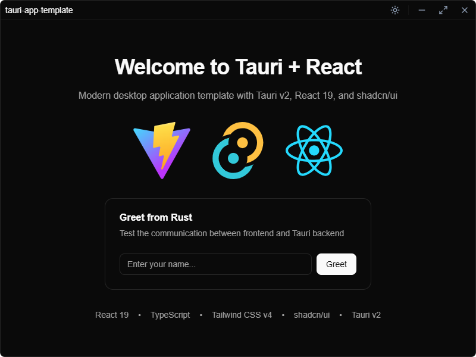

<div align="center">

# Tauri App Template

[English](./README.md) | 简体中文

[](https://tauri.app/)
[](https://react.dev/)
[](https://www.typescriptlang.org/)
[](./LICENSE)

基于 Tauri v2 + React 19 + TypeScript + shadcn/ui 的桌面应用模板。

</div>

## 预览



## 特点

- ✨ **现代化技术栈** - Tauri v2 + React 19 + TypeScript + Vite
- 🎨 **精美 UI 组件** - 集成 shadcn/ui 组件库和 Tailwind CSS v4
- 🌓 **暗色模式支持** - 内置亮色/暗色主题切换
- 🌍 **国际化支持** - 集成 i18next，支持中英文切换
- 🖼️ **自定义标题栏** - 无边框透明窗口，支持拖拽、最小化、最大化、关闭
- 🗂️ **多窗口管理** - 支持创建子窗口、窗口生命周期管理、延迟销毁机制
- 🔔 **系统托盘集成** - 支持托盘图标、菜单和窗口隐藏/显示
- ⌨️ **全局快捷键** - 支持注册全局快捷键，应用未聚焦时也能响应
- 🔄 **自动发布与更新** - 支持基于 `vX.Y.Z` 标签的 GitHub Actions 自动构建、Release 发布与自动更新
- 📦 **开箱即用** - 预配置 Prettier、ESLint 和 TypeScript 严格模式
- 🚀 **快速开发** - Vite HMR + Tauri 热重载

## 技术栈

- **桌面框架**: [Tauri v2](https://tauri.app/)
- **前端框架**: [React 19](https://react.dev/) + [TypeScript](https://www.typescriptlang.org/)
- **构建工具**: [Vite](https://vite.dev/)
- **UI 组件**: [shadcn/ui](https://ui.shadcn.com/)
- **样式方案**: [Tailwind CSS v4](https://tailwindcss.com/)
- **代码格式化**: [Prettier](https://prettier.io/)

## 开始使用

### 环境要求

- Node.js >= 18
- pnpm >= 9
- Rust >= 1.70

### 安装依赖

```bash
pnpm install
```

### 开发模式

```bash
pnpm tauri dev
```

### 构建发布

```bash
pnpm tauri build
```

### 版本管理

`pnpm release:version` 是版本发布的唯一入口。

```bash
pnpm release:version
pnpm release:version --lang zh
pnpm release:version --lang en
```

它会交互式完成发布前检查和版本更新流程：
- 确保工作区干净
- 强制要求当前分支为 `main`
- 校验 `package.json`、`src-tauri/tauri.conf.json` 和 `src-tauri/Cargo.toml` 的版本一致
- 检查目标 tag 是否已在本地或远端 `origin` 存在
- 同步更新这三个版本文件
- 创建发布提交和 `vX.Y.Z` tag
- 可选地推送分支和 tag

## 添加 shadcn/ui 组件

```bash
pnpm dlx shadcn@latest add <component-name>
```

示例：

```bash
pnpm dlx shadcn@latest add button
pnpm dlx shadcn@latest add input
pnpm dlx shadcn@latest add dialog
```

## 代码格式化

```bash
pnpm format        # 格式化代码
pnpm format:check  # 检查代码格式
```

## 项目结构

```
.
├── src/                    # 前端源码
│   ├── components/         # React 组件
│   │   └── ui/            # shadcn/ui 组件
│   ├── i18n/              # 国际化
│   │   ├── index.ts       # i18n 配置
│   │   └── locales/       # 翻译文件
│   ├── lib/               # 工具函数
│   ├── pages/             # 页面组件
│   │   ├── home.tsx       # 主窗口页面
│   │   ├── about.tsx      # 关于窗口页面
│   │   └── settings.tsx   # 设置窗口页面
│   └── main.tsx           # 前端入口和基于 pathname 的页面选择器
├── src-tauri/             # Tauri/Rust 后端
│   ├── src/               # Rust 源码
│   └── tauri.conf.json    # Tauri 配置
├── docs/                  # 文档
│   ├── AUTO_UPDATE.zh-CN.md # 自动更新指南
│   ├── I18N.zh-CN.md      # 国际化指南
│   └── GLOBAL_SHORTCUT.zh-CN.md # 全局快捷键指南
├── components.json        # shadcn/ui 配置
└── package.json
```

## CI/CD

本项目使用 GitHub Actions 实现自动化构建和发布。

### 自动化发布

工作流会在推送符合 `v*` 格式的标签时触发，例如 `v0.1.0`。
推荐通过 `pnpm release:version` 发版，它会自动创建匹配的 `vX.Y.Z` tag。

**手动创建并推送标签示例：**
```bash
git tag v0.1.0
git push origin v0.1.0
```

### 构建产物

工作流会生成：
- **NSIS 安装包** - Windows 安装程序
- **更新文件** - `latest.json` 用于自动更新支持

### 自动更新配置

要启用自动更新功能，需要：

1. 生成签名密钥：`pnpm tauri signer generate -w ~/.tauri/myapp.key`
2. 添加 GitHub Secrets：`TAURI_SIGNING_PRIVATE_KEY` 和 `TAURI_SIGNING_PRIVATE_KEY_PASSWORD`

**注意：** `src-tauri/tauri.conf.json` 中的公钥和更新端点占位符会在发布构建期间由 GitHub Actions 自动替换。自动更新依赖已发布的 GitHub Release 对外提供最新版本的 `latest.json` 资源。

详细配置说明请查看 [自动更新配置文档](./docs/AUTO_UPDATE.zh-CN.md)。

### 代码签名（可选）

如需启用代码签名，在 GitHub 仓库设置中添加以下 Secrets：
- `TAURI_SIGNING_PRIVATE_KEY` - 私钥内容
- `TAURI_SIGNING_PRIVATE_KEY_PASSWORD` - 私钥密码

不配置这些 Secrets 也能正常构建，只是安装包不会被签名。

### 多平台支持

如需启用 macOS 和 Linux 构建，取消 `.github/workflows/release.yml` 中对应平台配置的注释即可。

## IDE 推荐

- [VS Code](https://code.visualstudio.com/)
- [Tauri](https://marketplace.visualstudio.com/items?itemName=tauri-apps.tauri-vscode)
- [rust-analyzer](https://marketplace.visualstudio.com/items?itemName=rust-lang.rust-analyzer)

## License

MIT

## Star History

[](https://star-history.com/#kitlib/tauri-app-template&Date)
